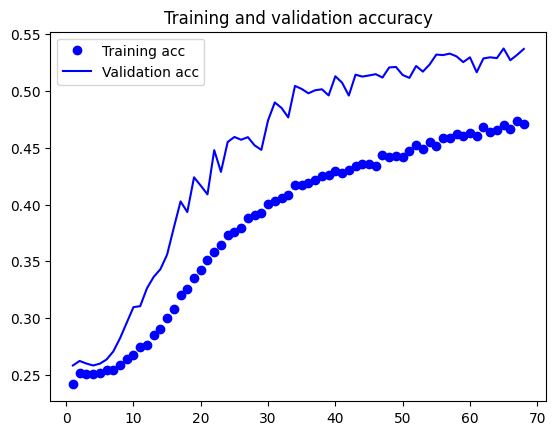
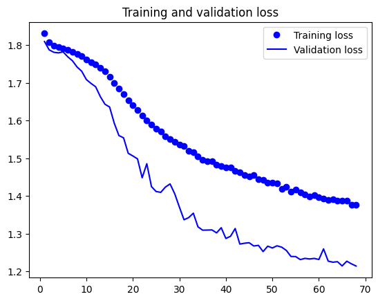
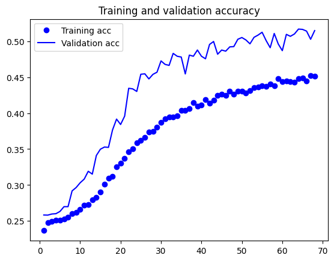
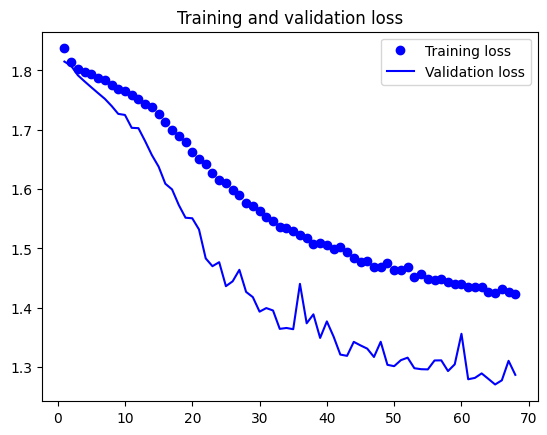
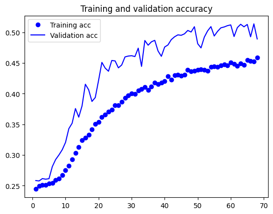
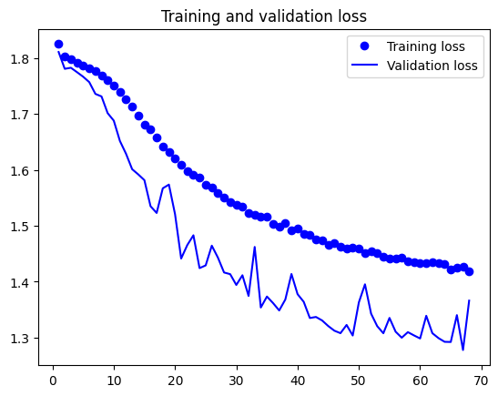
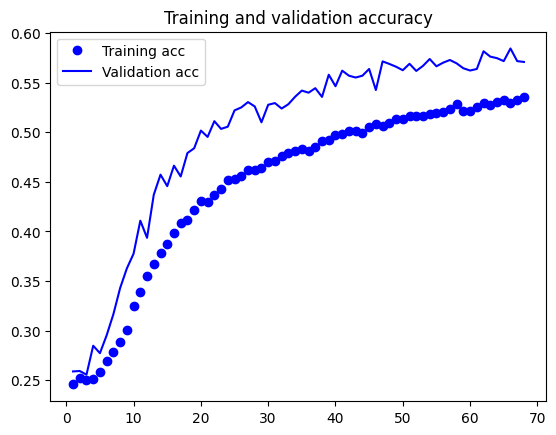
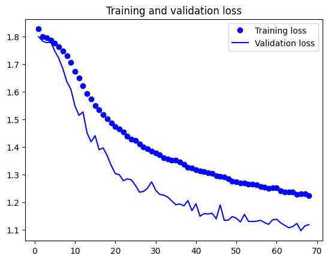
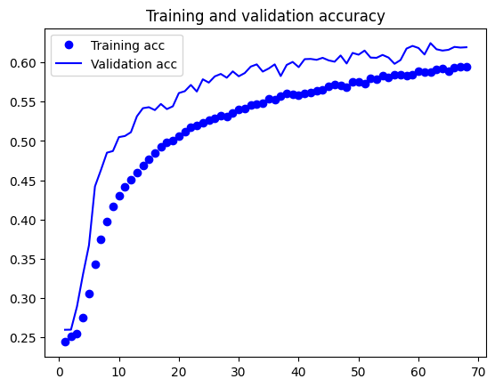

# Описание проведённых экспериментов

Для выбора оптимальной модели были проведены различные эксперименты с параметрами обучения, их результаты будут представлены ниже.

### Модель, использующая оптимизатор Adam:

### Модель со 128 нейронами в полносвязном слое:

### Модель с 512 нейронами в полносвязном слое:

### Модель с двойным размер свёрточных ядер (относительно тех, которые используются на данный момент) + Adam:

### Модель с двойным размер свёрточных ядер (относительно тех, которые используются на данный момент) + Adam + 512 нейронов:

### Вывод

При увеличении производственных мощностей можно продолжить увеличивать количество нейронов с оптимизатором Adam, есть все предположения считать, что это повысит точность классификации.
